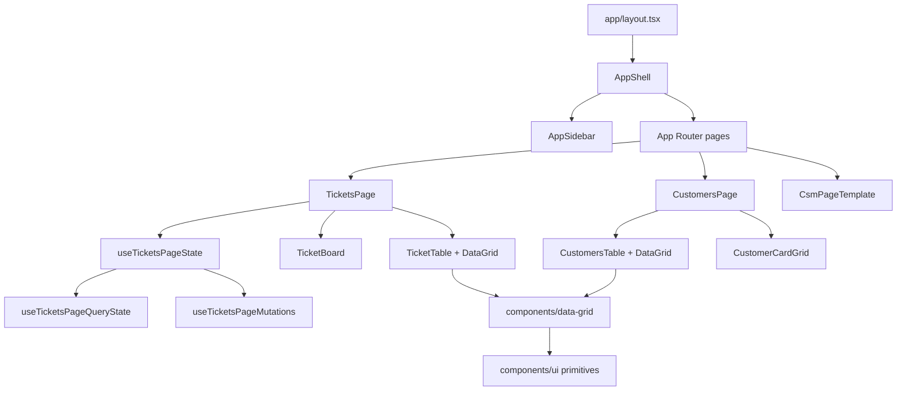

# Gray CSM UI Design Document

## Overview

Gray CSM UI is a UI-first Customer Success Management workspace built with Next.js App Router, React, TypeScript, Tailwind CSS v4, shadcn-style primitives, Base UI dialogs, and dnd-kit interactions.

The project is structured as a polished front-end demo rather than a production SaaS backend. It models realistic customer support workflows with local mock data, client-side state, URL-driven navigation, and reusable interface primitives.

## Product Goals

- Provide a dense operational workspace for customer success and support teams.
- Showcase ticket triage, ticket detail workflows, customer directory views, and reusable workspace scaffolding.
- Demonstrate production-quality design engineering patterns with mocked data.
- Keep route metadata, UI tokens, and reusable data grid behavior centralized enough for future expansion.

## Primary User Workflows

### Ticket Triage

The `/tickets` screen is the core workflow. Users can:

- Switch between board and table layouts.
- Filter by saved ticket views, query text, and queue status.
- Drag tickets across board columns.
- Open tickets in a drawer from the board or table.
- Create draft tickets.
- Bulk update selected table rows.
- Export selected tickets to CSV.
- Delete selected tickets with confirmation and undo feedback.

### Ticket Detail

The `/tickets/[ticketId]` route is a focused detail workspace. Users can:

- Review the ticket conversation.
- Submit replies and update queue status.
- Add and manage tasks.
- Reorder tasks with dnd-kit.
- Add internal notes.
- Review activity events.
- Use a collapsible right panel for details, people, and knowledge context.

Task state is persisted per ticket in `localStorage`; other detail state is local to the React session.

### Customer Directory

The `/customers` screen provides customer management workflows. Users can:

- Switch between table and card layouts.
- Filter by search, health, lifecycle, and sidebar views.
- Sort by risk, value, or recency.
- Mutate selected table rows.
- Export all visible or selected customers to CSV.
- Preview richer customer details from grid drawer content.

### Secondary Workspace Routes

Routes such as `/inbox`, `/accounts`, `/internal-notes`, `/knowledge-base`, `/macros`, `/automation`, and `/settings` use a shared `CsmPageTemplate`. They currently act as scaffolded screens with route-specific metrics, descriptions, primary actions, and sidebar preview content.

## Application Architecture

## Route Structure

- `app/page.tsx` redirects to `/tickets`.
- `app/layout.tsx` owns global metadata, fonts, theme provider, tooltip provider, and the application shell.
- `app/tickets/page.tsx` reads `view` and `layout` search params and passes them into `TicketsPage`.
- `app/tickets/[ticketId]/page.tsx` finds the mock ticket by id, builds detail data, validates the `tab` search param, and renders `TicketDetailPage`.
- `app/customers/page.tsx` reads `view` and `layout` search params and renders `CustomersPage`.
- Most other route pages render `CsmPageTemplate` using metadata from `lib/csm-routes.ts`.

## Shell and Navigation Design

`components/app-shell.tsx` wraps every route in a consistent workspace frame:

- A collapsible sidebar with icon rail and contextual secondary panel.
- A sticky top header for default workspace routes.
- Breadcrumbs sourced from route metadata.
- Header actions for search, notifications, chat, theme, and user profile.
- Special handling for ticket detail routes, where the sidebar is forced closed and the page gets a more focused full-height layout.

`components/app-sidebar.tsx` uses `lib/csm-routes.ts` as the source of truth for navigation labels, paths, icons, route descriptions, metrics, and sidebar previews. The sidebar swaps its secondary panel based on active route:

- Tickets use `TicketSidebarFilters`.
- Customers use `CustomerSidebarFilters`.
- Other routes use generic preview items.

## Component Organization

### `components/ui`

Reusable shadcn-style primitives such as buttons, badges, cards, dropdown menus, tables, sidebars, sheets, tabs, tooltips, labels, switches, inputs, and confirmation dialogs.

### `components/data-grid`

A generic reusable grid foundation used by tickets and customers. It provides:

- Column visibility and width management.
- Resizable columns.
- Column option ordering via dnd-kit.
- Row selection.
- Inline cell editing.
- Drawer panel editing/preview.
- Optional summary footer.
- Toolbar render props for feature-specific actions.

### `components/tickets`

Feature-owned ticket UI and state:

- `tickets-page.tsx` composes the main tickets workspace.
- `use-tickets-page-state.ts` joins query state, mutations, filters, derived stats, and drawer options.
- `use-tickets-page-query-state.ts` manages URL-backed view/layout/ticket state.
- `use-tickets-page-mutations.ts` manages ticket collection state, drafts, drawer lifecycle, create flow, message submission, deletion, restore, and board movement.
- `ticket-board.tsx` implements dnd-kit board movement.
- `ticket-table.tsx` adapts tickets to the reusable `DataGrid`.
- `ticket-detail-page.tsx` implements the full ticket detail route.

### `components/customers`

Feature-owned customer UI and state:

- `customers-page.tsx` manages filters, metrics, layout mode, selection actions, and export.
- `customer-table.tsx` adapts customers to `DataGrid`.
- `customer-card-grid.tsx` provides the alternate card layout.
- `customer-preview-drawer.tsx` provides richer table cell drawer content.

## Data Model and State

The app currently uses local TypeScript mock data:

- `lib/tickets/mock-data.ts`
- `lib/tickets/detail-data.ts`
- `lib/customers/mock-data.ts`
- `lib/current-user.ts`

Domain types live in:

- `lib/tickets/types.ts`
- `lib/customers/types.ts`

Most mutations are client-side React state updates. URL search params preserve high-level navigation context such as ticket view, layout, selected ticket drawer, and active ticket detail tab.

No server actions, API routes, database layer, authentication, authorization, or persistent backend storage are implemented.

## Interaction Patterns

- Layout switching uses segmented or toolbar controls.
- Ticket board movement uses dnd-kit drag and drop.
- Ticket and customer tables use selection bars for bulk actions.
- Feedback for ticket bulk actions appears as a fixed toast-like action bar with undo support.
- Destructive ticket deletion uses `ConfirmDialog`.
- Ticket create/edit flows use drawer state tied to the `ticket` search param.
- Ticket detail tabs are URL-backed through the `tab` search param.
- Ticket detail tasks are persisted to `localStorage`.

## Visual Design System

The design is token-driven through `app/globals.css`.

Key decisions:

- Geist and Geist Mono are loaded through `next/font`.
- Tailwind v4 theme variables map to CSS custom properties.
- Light and dark themes are expressed through OKLCH color tokens.
- The primary brand accent is a warm yellow/amber tone.
- Radius defaults to `0.625rem`, with derived radius scales.
- Sidebar tokens are separated from global background/card tokens.
- A custom `.btn-primary-chrome` class provides the main glossy primary button treatment.
- Motion uses an emphasized cubic bezier token.

The UI style is operational and dense: compact headers, grid-based metrics, sidebars, data tables, badges, and drawer panels are favored over marketing-style layouts.

## Responsiveness

The app accounts for smaller viewports in several places:

- Header actions collapse into a dropdown on small screens.
- The sidebar uses icon collapse behavior.
- Ticket table columns can be compacted for mobile.
- Floating mobile action buttons are used in the generic template.
- Ticket detail hides the right panel on mobile.
- Selection and feedback bars measure their containing page width with `ResizeObserver`.

## Extensibility Points

Good extension targets:

- Add real data fetching behind the mock data modules.
- Introduce server actions or API routes for ticket/customer mutations.
- Expand scaffolded route pages into real feature modules.
- Reuse `DataGrid` for additional operational tables.
- Add route metadata to `lib/csm-routes.ts` for new workspace sections.
- Add test coverage around bulk actions, query state, and grid editing.

## Production Gaps

Before production use, the project needs:

- Backend persistence for tickets, customers, notes, tasks, and replies.
- Authentication and user/session ownership.
- Authorization checks for sensitive actions.
- API error states and retry behavior.
- Loading states for async data.
- Validation for create/edit forms.
- Real notification/search/chat integrations.
- Accessibility review for complex drag-and-drop and grid interactions.
- Automated tests for high-risk workflows.
- Analytics or audit logging for operational actions.

## Recommended Next Steps

1. Define a backend contract for tickets, customers, tasks, notes, and conversation events.
2. Replace mock data imports with repository/service functions.
3. Move mutating workflows behind server actions or API routes.
4. Add focused tests for ticket bulk actions, board movement, ticket detail task persistence, and customer filtering.
5. Expand one scaffolded route at a time, keeping the current shell and route metadata pattern.
